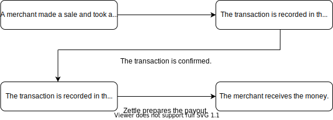

How payments work at Zettle
===
A merchant's Zettle account handles different status of transactions. After a merchant takes a payment with Zettle, the transaction for the payment will go through the following phases in sequence as shown in [Figure 1 Zettle transaction flow](#Zettle-transaction-flow):
1. Recorded in the merchant's preliminary account:
 
   Zettle checks the transaction with the acquiring bank to capture the funds.
   
2. Recorded in the merchant's liquid account:

   Zettle checks whether the payment is ready to be paid out to the merchant.
   
3. Recorded as payout in the merchant's liquid account: 
  
   Zettle makes sure that the correct amount of money will be paid out from the merchant's Zettle account to the merchant's bank account or PayPal Wallet for PayPal users. Then the merchant will receive the deposit in the upcoming payout.
   
> **Note:** The amount of time for the money to be paid out varies depending on the country. For country-specific information, check [Zettle Help Centre](https://www.zettle.com/help/articles/1084784-deposits).

<figure >  <figcaption><b>Figure 1. </b>Zettle transaction flow</figcaption></figure>

