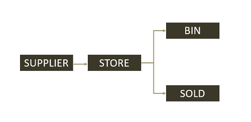

How inventories work
===
Inventory management includes tracking of inventory levels, orders, and sales across channels and locations. The Zettle Inventory service keeps track of the stock level for product variants. Through the Zettle Inventory API, client applications can list current stock levels and update product balances. The service automatically decreases the stock when a purchase is made within the POS system.

## Using the API

### Base URL
`https://inventory.izettle.com`

### API documentation
https://inventory.izettle.com/swagger

### OAuth scope
The Inventory API requires the following scopes:
- `READ:PRODUCT`
- `WRITE:PRODUCT`

## Authorization
To integrate with Zettle, you need to access merchant data. To gain access, you need to set up authorization for the merchant to grant access to the data. Depending on the type of app and integration you are building, this can be done in different ways. See [Authorization OAuth API](../../authorization.md).

## Tracking 
The Inventory service provides handling and tracking of items in the product library. Sales through the POS system will automatically be tracked and the inventory is updated accordingly. 

You must first enable tracking of products, in order for the inventory balance calculations to work. Product tracking can be enabled/disabled at any time.

**Example:** Start product tracking and set initial inventory balance.
```http
POST /organizations/self/v2/inventory/bulk
```
See [Enable tracking](../user-guides/manage-inventory-tracking/enable-tracking.md).

## Locations and inventory flow
The Inventory service keeps track of inventory balances by moving product items between so-called *locations*. These are created automatically by the service when tracking is enabled for a product. 

A location can be seen as a bucket containing individual balances for product variants. In a typical setup, a merchant has a single main physical store room or warehouse. This location corresponds to the `STORE` type in the Inventory service. This is the location of the current available stock for a product variant.

The system also has a number of virtual `Location` types for which balances are not tracked:

- `SOLD`. Sold items are moved to this `Location` type.
- `BIN`. Items that have been discarded are moved to this `Location` type. Also used for emptying an inventory.
- `SUPPLIER`. Restocked items are moved into the inventory from this `Location` type. This holds infinite stock.

<figure >  <figcaption><b>Figure 1. </b>The inventory stock balance flow.</figcaption></figure><br>
</br>

**Note:** Inventory locations are created and managed by the system. Multiple locations are **not** supported, meaning that you can only have one location of type `STORE`.

### Location UUIDs
When product tracking is enabled, the Inventory service creates a location identifier UUID associated with a specific merchant’s organization. This location UUID is then used to perform various inventory operations. 

**Example:** Retrieve all inventory location UUIDs.
```http
GET /organizations/self/locations
```
See [Fetch inventory locations](../user-guides/manage-locations/fetch-inventory-locations.md).

## Updating inventory balances
A product’s inventory balance is updated by transferring an inventory amount for a product variant from one location to another. Multiple updates can be made with a single request.

- Purchase. Move from `STORE` to `SOLD`.
- Re-stock. Move from `SUPPLIER` to `STORE`.
- Empty inventory. Move from `STORE` to `BIN`.

**Example:** Purchase of a specific product.
```http
PUT /organizations/self/inventory
```
The request body contains the parameters for the inventory flow. In the case of a purchase, this is the move from `STORE` to `SOLD` locations.
```json
{
  "changes": [
    {
      "productUuid": "{{product_uuid}}",
      "variantUuid": "{{product_variant_uuid}}",
      "change": "1",
      "fromLocationUuid": "{{store_location_uuid}}",
      "toLocationUuid": "{{sold_location_uuid}}"
    }
  ],
  "externalUuid": "947d712a-892d-11ea-bc55-0242ac130003"
}
```
See [Update inventory balance](../user-guides/manage-inventory-balances/update-inventory-balance.md). 

### Event notifications
Inventory balance updates can be the result of either a purchase event, or an explicit update request. Such a request will trigger webhook event notifications for balance updates similar to purchase events.

The UUID can be used to make it easier for a client to match an API request with the received webhook notification. To do this, the client can pass the desired UUID in the `externalUuid` parameter when sending a balance update request. This parameter will then be passed through. If the update causes notifications to be sent out, the UUID will be included in the webhook event payload.

## Setting inventory balances
**Note:** You cannot set a stock balance for a variant directly. To set an absolute value of a variant, you need to calculate the change needed to reach that stock value.

**Example:** You have 30 stock in `STORE` and want to set that to 20. To do this you move 10 stock to the `SOLD`, `BIN` or `SUPPLIER` location, depending on the reason for the stock change. Note that you always move *positive* numbers.
```http
PUT /organizations/self/inventory
```
```json
{
  "changes": [
    {
      "productUuid": <uuid>,
      "variantUuid": <uuid>,
      "fromLocationUuid": <STORE_location_uuid>,
      "toLocationUuid": <SOLD_location_uuid>,
      "change": 10
    }
  ]
}
```
**Example:** You have 30 in stock and want to set to 40. You then move 10 stock from `SUPPLIER` to `STORE`.
```http
PUT /organizations/self/inventory
```
```json
{
  "changes": [
    {
      "productUuid": <uuid>,
      "variantUuid": <uuid>,
      "fromLocationUuid": <SUPPLIER_location_uuid>,
      "toLocationUuid": <STORE_location_uuid>,
      "change": 10
    }
  ]
}
```
## Retrieving inventory balances
Tracked product inventory balances can be accessed per product, or as list of all tracked items for the `Location`.

**Example:** Retrieve inventory balance for a given location UUID.
```http
GET /organizations/self/inventory/locations/{locationUuid}
```
The response will contain the `STORE` location ID and the product variants with non-zero inventory balances.

See [Fetch inventory balance](../user-guides/manage-inventory-balances/fetch-inventory-balance.md). 

## Low stock management
The low stock threshold level is a quantity you can set to help merchants manage the inventory. The low stock level is the minimum amount of inventory a merchant wants to have on hand. When implemented, the merchant will receive an indication that replenishment is needed for a specific product and location.

**Example:** Set low stock level for a product/variant in a given location UUID.
```http
POST /custom-low-stock/locations/{locationUuid}
```
See [Set or update low stock level](../user-guides/manage-low-stock-levels/set-low-stock-level.md). 

## Organization URLs
Many endpoints in the Inventory API have URLs that begin like this:
```
/organization/self/…
```

The `self` part in these URLs is actually a shortcut. Instead of `self`, you can use the organization UUID of the merchant that should be affected by the request. When using `self`, it is treated on the server-side as referring to the organization saved in the request's authorization token. This is the merchant that the client authenticated for.

Since merchants generally don't have access rights to other merchants' organizations, using `self` is the most convenient way for many API users. 

Using the organization UUID also provides a valid URL to access the `locations` endpoint for the organization `123e4567-e89b-12d3-a456-426614174000
`, like in this example:

```http
GET /organizations/123e4567-e89b-12d3-a456-426614174000/locations
```


## Related information
- [Manage locations](../user-guides/manage-locations/)
- [Manage inventory tracking](../user-guides/manage-inventory-tracking/) 
- [Manage inventory balances](../user-guides/manage-inventory-balances/)
- [Manage low stock levels](../user-guides/manage-low-stock-levels/)
