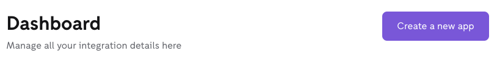
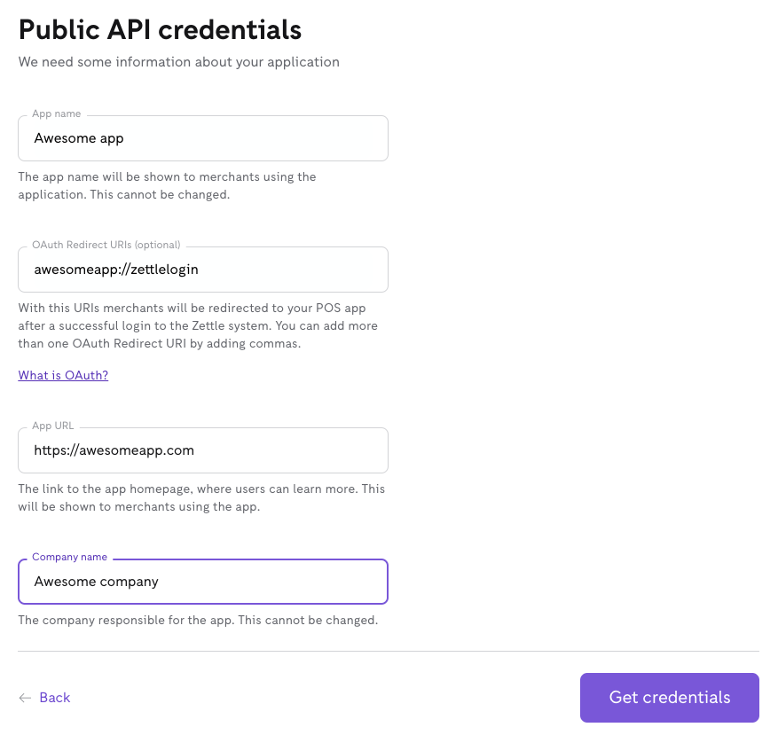
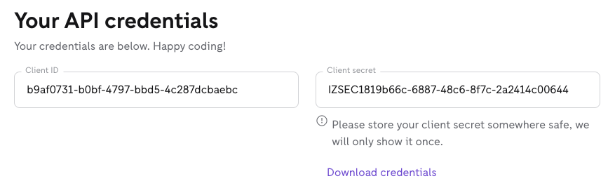
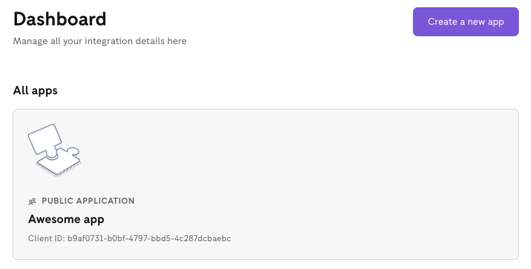
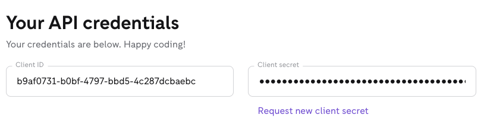

Create a partner-hosted app
===
A partner-hosted app is hosted by you as an integrator. To authorise, the app uses the authorisation code grant.

In an authorisation code grant flow, you use a temporary authorisation code to exchange for an access token from the authorisation server. A temporary authorisation code is generated from the authorisation server using API credentials. API credentials include a client secret and client ID.

To authorise your app using authorisation code grant, you need to get API credentials for the app by creating an app in your Dashboard on the [Developer Portal](https://developer.zettle.com/).
> **Note:** If you want to build a self-hosted app that will be hosted by merchants, [create a self-hosted app](create-a-self-hosted-app).

* [Prerequisites](#prerequisites)
* [Get API credentials for a new app](#get-api-credentials-for-a-new-app)
* [Request a new client secret for an existing app](#request-a-new-client-secret-for-an-existing-app)
* [Next task](#next-task)
* [Related API reference](#related-api-reference)

## Prerequisites
* You have an account for the [Developer Portal](https://developer.zettle.com/). If you don't have an account, [sign up for a developer account](../../../get-started/user-guides/sign-up-for-a-developer-account.md).

## Get API credentials for a new app
If you need API credentials for a new app, create a public app in your Dashboard.
 
1. Log in to the [Developer Portal](https://developer.zettle.com/).    
2. On your Dashboard, click **Create a new app**. <!-- screesshot. Click or select?-->
   
   
3. On the Create a new app page, click **Public API credentials** to open the form for the new app.
4. Fill in the form for the new app.
   
   
5. Click **Get credentials** to create your API credentials.
6. Download your API credentials and save them somewhere safe.
   
   
   
   > **Tip:** As the client ID doesn't change, if you lose the API credentials, you can [request a new client secret](#request-a-new-client-secret-for-an-existing-app).

## Request a new client secret for an existing app
The client ID of an existing app doesn't change. If you need a new client secret for an existing app, request it in your Dashboard.

1. Log in to the [Developer Portal](https://developer.zettle.com/).    
2. On your Dashboard, choose the app for which you need to request a new secret. The current client secret is hidden.
   
   
   
3. On the app page, click **Request new client secret** to deactivate the current secret and generate a new secret. The new client secret will be shown.
   
      

4. Download your API credentials and save them somewhere safe.

## Next task
* [Set up authorisation code grant](../set-up-app-authorisation/set-up-authorisation-code-grant.md)

## Related API reference
* [OAuth2 API Reference](../../../authorization.md)