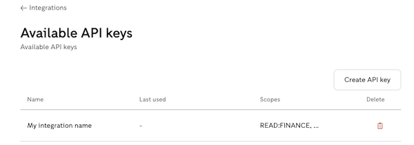
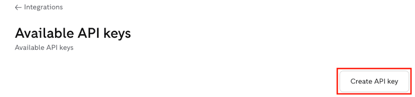

Create an API key
======

An API key is used in the authorisation assertion grant flow for an app. It must be created by a Zettle merchant in their my.zettle.com.

If you're developer of a self-hosted app, share this guide with the merchant that will use the app.

* [Create an API key with a link from the developer](#create-an-api-key-with-a-link-from-the-developer)
* [Create an API with OAuth scopes from the developer](#create-an-api-key-with-oauth-scopes-from-the-developer)

## Prerequisites
* You are a Zettle merchant and have an account at my.zettle.com.
* You have a link or OAuth scopes from the developer of the app that you will use.  The OAuth scopes are permissions that you give to the developer to access your Zettle account data. 

## Create an API key with a link from the developer

1. Open the link from the developer.

2. Enter your Zettle account password.
   
3. Review the information and click **Create key**. A client ID will be created together with the API key.
       
          
    
4. On the Create API key page, click **Copy key**. Keep the API key and the client ID as secret somewhere safe.
       
   
    
5. Share the API key and client ID with the developer who sent you the link.
    
   The created key is shown in the list of keys. After the integration starts working with the key, the Last used column will show the last time the integration accessed your Zettle data. 
       
   

## Create an API key with OAuth scopes from the developer

1. Go to [my.zettle.com](https://my.zettle.com/) and log in to your account. 

2. On the left panel, click **Integrations**.

   
 
3. Under the Integration tools section, click **API Keys**.

   
       
4. Click **Create API Key**.
   
   
   
5. Give a name to your key. Keep it short and descriptive. One good practice is to use the integration name as the key name.

6. Select the OAuth scopes that the developer provided. The OAuth scopes are permissions that you give to the developer to access your Zettle account data.
    
7. Click **Create key**. A client ID will be created together with the API key.
 
   
   
8. Confirm your password.

9. On the Create API key page, click **Copy key**. Keep the API key and the client ID as secret somewhere safe. 
 
   
   
10. Share the API key and client ID with the developer.
        
    The created key is shown in the list of keys. After the integration starts working with the key, the Last used column will show the last time the integration accessed your Zettle data. 
 
    
    
## Related task
* [Create a self-hosted app](create-a-self-hosted-app.md)

## Related API reference
None