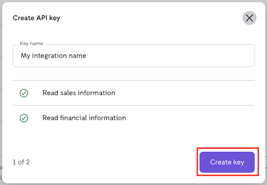
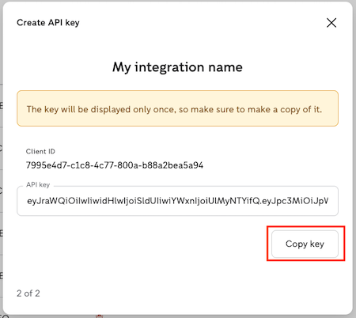
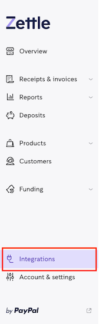
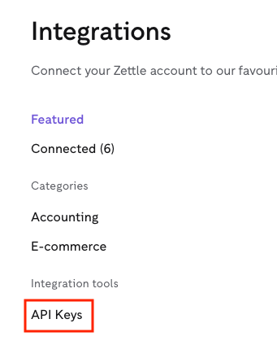
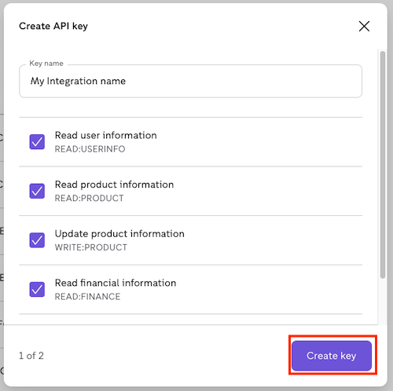

Zettle Password grant migration guide
===
The Password grant for Zettle integrations is now deprecated and will be removed on January 31th  2022.

* [Action needed](#action-needed)
* [Support](#support)
* [Technical details](#technical-details)
* [Assertion grant API keys](#assertion-grant-api-keys)
  * [Option 1: Create the API Key using a link](#option-1-create-the-api-key-using-a-link)
  * [Option 2: Create the API Key by accessing my.zettle.com](#option-2-create-the-api-key-by-accessing-myzettlecom)

## Action needed
Update the integration to use an authentication grant supported by Zettle. You can find more information in this document and in the [Zettle OAuth2 API documentation](../../authorization.adoc).

## Support 
If you have any questions, please contact our service desk by sending an email to our [Integrations team](mailto:api@zettle.com). 
 
## Technical details
Zettle API uses the OAuth 2.0 Authorization Framework. The Assertion grant is recommend to keep your integration private. For more information about the assertion grant and other authentication flows, read more in the [Zettle OAuth2 API documentation](../../authorization.adoc). 

## Assertion grant API Keys
To use this approach, the merchant using the integration needs to provide you with the API Key. The API key is created at [my.zettle.com](https://my.zettle.com/) by the Zettle account owner (merchant). The creation process can be started in one of the following ways:
 
   * [Option 1: Create the API Key using a link](#option-1-create-the-api-key-using-a-link). 
   
     A deep link provided by the integrator and shared with the merchant
   
   * [Option 2: Create the API Key by accessing my.zettle.com](#option-2-create-the-api-key-by-accessing-myzettlecom).
     
     The merchant accesses the API Key page at my.zettle.com. See more details of each option below and please share the screenshots with the merchant if needed. 

### Option 1: Create the API Key using a link

1. In order to make it as easy as possible for the merchant to create the API key, the integrator can provide a deep link to the API key creation page with pre-populated fields: 
     
   ```
   https://my.zettle.com/apps/api-keys?name=<key-name>&scopes=<scopes>
   ```
   Where:
   * `<key-name>` should be the name under which the API key is stored. Keep it short, but descriptive. One good practice is to use the integration name as the key name, for example, `WooCommerce Sync`.
   * `<scopes>` should contain the list of needed scopes separated by a space, for example, `READ:PURCHASE+READ:FINANCE`.
   
   Example:
   ```
   https://my.zettle.com/apps/api-keys?name=WooCommerce&scopes=READ:PURCHASE+READ:FINANCE
   ```
2. When the merchant accesses the link, ask them to follow the steps to confirm the API key creation.

   a. Review the information and click **Create key**.
       
      
       
    b. Confirm your password.
    
    c. The API Key has been created. Click **Copy key** and keep it in a safe place. This is the information you need to share with the developer in charge of the changes.
       
      
    
    d. The created key will be displayed in the list of keys. Once the integration starts working with this key, the Last used column will show the last time the integration accessed your Zettle data. 
       
      
       
### Option 2: Create the API Key by accessing my.zettle.com
Ask the merchant to follow the steps to create the API key by accessing [my.zettle.com](https://my.zettle.com/).

1. Go to [my.zettle.com](https://my.zettle.com/) and log in to your account. 

2. On the left panel, click **Integrations**.

   
 
3. Under the Integration tools section, click **API Keys**.

   
       
4. Click **Create API Key**.
   
   
   
5. Give a name to your key. Keep it short, but descriptive. One good practice is to use the integration name as the key name.

6. Select which accesses the integration needs. If you’re not sure what to choose, contact the developer in charge of the changes.
    
7. Click **Create key**.
 
   
   
8. Confirm your password.

9. The API Key has been created. Click **Copy key** and keep it in a safe place. This is the information you need to share with the developer in charge of the changes.
 
   
   
10. The created key will be displayed in the list of keys. Once the integration starts working with this key, the Last used column will show the last time the integration accessed your Zettle data.
 
    